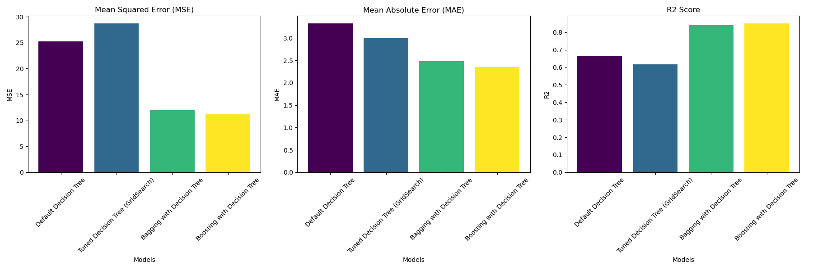

# Boston Housing ML Project

This project implements machine learning models to predict housing prices in Boston using different techniques such as decision trees, bagging, and boosting. It provides an easy-to-follow framework for data preprocessing, training, evaluating, and visualizing the results.

## Project Overview

Data is retrieved from https://lib.stat.cmu.edu/datasets/boston.
The goal of this project is to predict housing prices in Boston based on several features. The dataset is widely used in machine learning for regression tasks. Various regression models are trained, evaluated, and their performances are compared using metrics such as Mean Squared Error (MSE), Mean Absolute Error (MAE), and R² score. Additionally, the project includes cross-validation and visualization of results.



## Installation and Setup

### **Setting up the Conda Environment**

To set up the project, it is recommended to use the provided `environment.yml` file to create a conda environment with the necessary dependencies.

```bash
conda env create -f environment.yml
conda activate ml_general

# download/copy data into raw.txt in ./data/raw.txt
python -m boston_housing/etl.py
python -m boston_housing/dt.py
```

## License

This project is licensed under the MIT License.
MIT License

Copyright (c) 2024 Ben Truong

Permission is hereby granted, free of charge, to any person obtaining a copy
of this software and associated documentation files (the "Software"), to deal
in the Software without restriction, including without limitation the rights
to use, copy, modify, merge, publish, distribute, sublicense, and/or sell
copies of the Software, and to permit persons to whom the Software is
furnished to do so, subject to the following conditions:

The above copyright notice and this permission notice shall be included in all
copies or substantial portions of the Software.

THE SOFTWARE IS PROVIDED "AS IS", WITHOUT WARRANTY OF ANY KIND, EXPRESS OR
IMPLIED, INCLUDING BUT NOT LIMITED TO THE WARRANTIES OF MERCHANTABILITY,
FITNESS FOR A PARTICULAR PURPOSE AND NONINFRINGEMENT. IN NO EVENT SHALL THE
AUTHORS OR COPYRIGHT HOLDERS BE LIABLE FOR ANY CLAIM, DAMAGES OR OTHER
LIABILITY, WHETHER IN AN ACTION OF CONTRACT, TORT OR OTHERWISE, ARISING FROM,
OUT OF OR IN CONNECTION WITH THE SOFTWARE OR THE USE OR OTHER DEALINGS IN THE
SOFTWARE.
